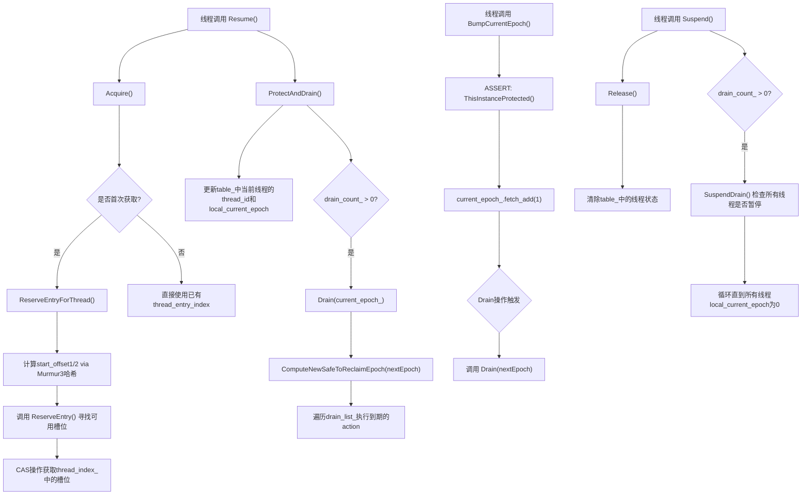
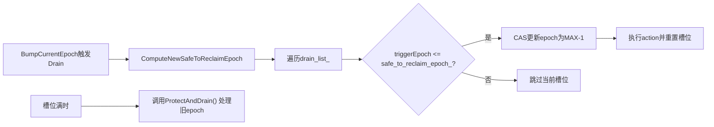
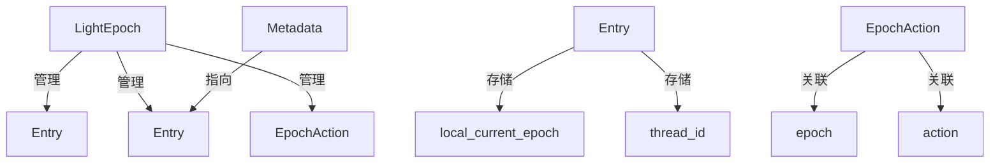

# Epoch Protection

Epoch Protection 是一种用于并发编程的内存管理技术，特别是在无锁数据结构中广泛使用。它通过引入"epoch"（时期）的概念来安全地延迟内存回收，确保不会出现访问已释放内存的情况。下面我将详细解释其原理，并给出具体示例。

Epoch Protection 机制主要包含以下几个核心组件：

- **原子计数器**：系统维护一个原子计数器，称为当前`epoch`（可理解为一个时代或阶段的编号），任何线都可以对其进行递增操作。每个线程也都有一个本地副本，用于记录该线程所处于的`epoch`阶段。
- **共享Epoch表**：所有线程的本地`epoch`值都存储在一个共享的`Epoch`表中，每个线程对应一个缓存行通过这个表，系统可以跟踪所有线程的`epoch`状态。
- **安全Epoch判断**：当所有线程的本地`epoch`值都大于某个全局的`epoch`值`c`时，就认为`c`是安的。此外，系统还维护一个全局的`E_s`，用于记录最大的安全`epoch`。`E_s`会根据共享`Epoch`表的更新同步更新。
- **Trigger Actions**：这是对基本`Epoch`框架的增强。当一个`epoch`变得安全时，可以执行任何全局作。线程在本地递增`epoch`为`X`时，可以关联一个`Action`（回调函数），当`epoch X`变为安全时，系会触发这个回调函数。这个功能通过`drain list`实现，它是一个由`<epoch, action>`组成的操作对列表通过扫描该列表来执行到期的操作，并使用原子的`CAS`操作确保每个`action`只执行次

其核心思想是：**当一个对象不再被任何线程访问时，延迟两个epoch周期后再安全回收**。这样确保所有可能持有该对象引用的线程都已离开临界区。

## 工作流程

- **Acquire**：为线程`T`创建一个`epoch`，并将线程`T`的本地`epoch`值`E_T`设置为指定的`E`。
- **Refresh**：将线程的本地`epoch`值更新为全局当前`epoch`值，并更新全局最大安全`epoch``E_s`，同时执行`drain list`中就绪的`Actions`。
- **BumpEpoch**：把全局当前`epoch`值更新为当前值加1，并添加一个`<E, Action>`到`drain list中，以便在`E`这个`epoch`变为安全时执行相应的`Action`。
- **Release**：从全局共享的`Epoch`表中删除线程`T`，表示该线程不再参与当前的`epoch`保护机制。

## 为什么需要两个epoch的延迟？

当系统处于epoch N+2时：

- 所有活跃线程的epoch至少为N+1（因为它们会更新到最新epoch）
- 这意味着没有线程会访问epoch N的对象
- 因此可以安全回收epoch N的垃圾列表

这种设计确保了**内存安全**和**无锁并发**的特性。

## 实际应用示例：无锁栈实现

以下是使用Rust的crossbeam-epoch库实现的无锁栈示例：

```rust
use crossbeam_epoch::{self as epoch, Atomic, Owned, Shared};
use std::mem::ManuallyDrop;
use std::ptr;
use std::sync::atomic::Ordering::{Acquire, Relaxed, Release};

#[derive(Debug)]
pub struct TreiberStack<T> {
    head: Atomic<Node<T>>,
}

#[derive(Debug)]
struct Node<T> {
    data: ManuallyDrop<T>,
    next: Atomic<Node<T>>,
}

impl<T> TreiberStack<T> {
    pub fn new() -> TreiberStack<T> {
        TreiberStack {
            head: Atomic::null(),
        }
    }

    pub fn push(&self, t: T) {
        let mut n = Owned::new(Node {
            data: ManuallyDrop::new(t),
            next: Atomic::null(),
        });

        let guard = epoch::pin(); // 进入epoch保护区域

        loop {
            let head = self.head.load(Relaxed, &guard);
            n.next.store(head, Relaxed);

            match self.head.compare_and_set(head, n, Release, &guard) {
                Ok(_) => break,
                Err(e) => n = e.new,
            }
        }
    }

    pub fn pop(&self) -> Option<T> {
        let guard = epoch::pin(); // 进入epoch保护区域
        loop {
            let head = self.head.load(Acquire, &guard);

            match unsafe { head.as_ref() } {
                Some(h) => {
                    let next = h.next.load(Relaxed, &guard);

                    if self.head.compare_and_set(head, next, Relaxed, &guard).is_ok() {
                        unsafe {
                            guard.defer_destroy(head); // 延迟销毁节点
                            return Some(ManuallyDrop::into_inner(ptr::read(&(*h).data)));
                        }
                    }
                }
                None => return None,
            }
        }
    }
}
```

在这个实现中：

1. `epoch::pin()`创建一个Guard，将线程标记为活跃并更新本地epoch
2. `defer_destroy()`将要回收的内存放入垃圾列表
3. 当epoch前进足够时，这些内存会被自动回收

下面是[基于Epoch Protection用C++实现的一个无锁Stack](https://godbolt.org/z/oWo1WMbsP)：

```cpp
#include <atomic>
#include <thread>
#include <vector>
#include <iostream>
#include <functional>
#include <memory>
#include <map>

class EpochManager {
public:
    static constexpr int64_t kEpochCount = 3;

    EpochManager() : global_epoch_(0) {
        for (auto& count : epoch_counts_) {
            count.store(0, std::memory_order_relaxed);
        }
        for (int64_t i = 0; i < kEpochCount; ++i) {
            deferred_objects_.push_back(std::map<void *, std::function<void()>>());
        }
    }

    ~EpochManager() {
        for (int64_t e = 0; e < kEpochCount; ++e) {
            ReclaimObj(e);
        }
    }

    class CriticalSection {
        public:
        CriticalSection(EpochManager* epoch_manager) : mgr_(epoch_manager) {
            local_epoch_ = mgr_->global_epoch_.load(std::memory_order_relaxed);
            mgr_->epoch_counts_[local_epoch_ % kEpochCount].fetch_add(1, std::memory_order_relaxed);
        }

        ~CriticalSection() {
            mgr_->epoch_counts_[local_epoch_ % kEpochCount].fetch_sub(1, std::memory_order_relaxed);
        }

        template <typename T>
        void DeferDelete(T *ptr) {
            auto current_epoch = local_epoch_;
            mgr_->deferred_objects_[current_epoch % kEpochCount][(void *)ptr] = [ptr](){delete ptr;};
            mgr_->TryAdvanceEpoch();
        }

    private:
        EpochManager* mgr_;
        int64_t local_epoch_;
    };

private:
    void TryAdvanceEpoch() {
        auto current_epoch = global_epoch_.load(std::memory_order_relaxed);
        for (int64_t e = current_epoch - (kEpochCount - 1); e <= current_epoch; e++) {
            if (epoch_counts_[e % kEpochCount].load(std::memory_order_relaxed) != 0) {
                return;
            }
        }
        global_epoch_.fetch_add(1, std::memory_order_relaxed);
        int64_t reclaim_epoch = current_epoch  - 2;
        if (reclaim_epoch >= 0) {
            ReclaimObj(reclaim_epoch % kEpochCount);
        }
    }

    void ReclaimObj(int64_t reclaim_epoch) {
        for (auto &deferred : deferred_objects_[reclaim_epoch]) {
            deferred.second();
        }
        deferred_objects_[reclaim_epoch].clear();
    }

private:
    std::atomic<int64_t> global_epoch_;
    std::atomic<int64_t> epoch_counts_[kEpochCount];
    std::vector<std::map<void *, std::function<void()>>> deferred_objects_;

};

template <typename T>
class LockFreeStack {
private:
    struct Node {
        T data;
        Node* next;

        Node(const T& data) : data(data), next(nullptr) {}
    };

    std::atomic<Node*> head_;
    EpochManager epoch_manager_;

public:
    ~LockFreeStack() {
        Node* current = head_.load(std::memory_order_relaxed);
        while (current) {
            Node* next = current->next;
            delete current;
            current = next;
        }
    }

    void push(const T& data) {
        Node* new_node = new Node(data);
        typename EpochManager::CriticalSection guard(&epoch_manager_);

        new_node->next = head_.load(std::memory_order_relaxed);
        while (!head_.compare_exchange_weak(new_node->next, new_node,
                                          std::memory_order_release,
                                          std::memory_order_relaxed)) {
            // CAS失败，重试
                                          }
    }

    bool pop(T& result) {
        typename EpochManager::CriticalSection guard(&epoch_manager_);

        Node* old_head = head_.load(std::memory_order_acquire);
        if (!old_head) return false;

        while (!head_.compare_exchange_weak(old_head, old_head->next,
                                          std::memory_order_release,
                                          std::memory_order_relaxed)) {
            if (!old_head) return false;
                                          }

        result = old_head->data;
        guard.DeferDelete(old_head); // 安全延迟删除
        return true;
    }
};

int main() {
    LockFreeStack<int> stack;
    const int THREAD_COUNT = 4;
    const int OPERATIONS_PER_THREAD = 1000;

    std::vector<std::thread> threads;

    for (int i = 0; i < THREAD_COUNT; ++i) {
        threads.emplace_back([&stack, i]() {
            for (int j = 0; j < OPERATIONS_PER_THREAD; ++j) {
                stack.push(i * OPERATIONS_PER_THREAD + j);
                int val;
                if (stack.pop(val)) {
                    // 成功弹出值
                    std::cout << "Popped: " << val << std::endl;
                }
            }
        });
    }

    for (auto& t : threads) {
        t.join();
    }

    std::cout << "All operations completed successfully!" << std::endl;

    return 0;
}
```

## Another Example

微软在FasterKV中，基于`Epoch Protection`思想，实现了一个管理并发操作的版本状态机。

首先介绍其`LightEpoch`的实现：

* Epoch：Epoch 是一个全局的版本号，用于标识系统的不同状态。每当系统状态发生变化时，Epoch 会递增。线程可以通过进入和离开受保护的代码区域来与 Epoch 进行交互。
* Epoch 表：用于记录每个线程当前所在的 Epoch。每个线程在进入受保护的代码区域时，会在 Epoch 表中记录自己的 Epoch 信息；离开时则清除该信息
* Drain 列表：用于存储需要在某个 Epoch 变为安全可回收时执行的操作。当某个 Epoch 不再被任何线程使用时，会执行 Drain 列表中与该 Epoch 相关的操作。

下面是一个C++复刻版的实现：

```cpp
/*
 * a re-implement of LightEpoch from FasterKV of microsoft
 * ref: https://github.com/microsoft/FASTER/blob/main/cs/src/core/Epochs/LightEpoch.cs
 */

#include <algorithm>
#include <thread>
#include <assert.h>

#include <iostream>
#include <vector>
#include <atomic>
#include <thread>
#include <functional>
#include <mutex>
#include <algorithm>

// 定义缓存行大小
constexpr int kCacheLineBytes = 64;
// 定义无效索引
constexpr int kInvalidIndex = 0;
// 定义表大小
constexpr int kTableSize = 128;
// 定义 drain 列表大小
constexpr int kDrainListSize = 16;

// 定义 Epoch 表条目结构体
struct alignas(kCacheLineBytes) Entry {
    // 线程本地的 Epoch 值
    std::atomic<long> local_current_epoch{0};
    // 线程 ID
    std::atomic<int> thread_id{0};
    // 重入标志
    std::atomic<int> reentrant{0};
    // 标记数组
    long markers[6] = {0};

    std::string ToString() const {
        return "lce = " + std::to_string(local_current_epoch.load()) + ", tid = " + std::to_string(thread_id.load()) + ", re-ent " + std::to_string(reentrant.load());
    }
};

// 定义 Epoch 操作对结构体
struct EpochAction {
    std::atomic_long epoch;
    std::function<void()> action;

    std::string ToString() const {
        return "epoch = " + std::to_string(epoch) + ", action = " + (action ? action.target_type().name() : "n/a");
    }
};

// 定义 Metadata 类，用于存储线程本地数据
class Metadata {
public:
    static thread_local int thread_id;
    static thread_local int start_offset1;
    static thread_local int start_offset2;
    static thread_local int thread_entry_index;
    static thread_local int thread_entry_index_count;
};

thread_local int Metadata::thread_id = 0;
thread_local int Metadata::start_offset1 = 0;
thread_local int Metadata::start_offset2 = 0;
thread_local int Metadata::thread_entry_index = kInvalidIndex;
thread_local int Metadata::thread_entry_index_count = 0;

// 定义 LightEpoch 类
class LightEpoch {
    friend class LightEpochTest_MarkerAndCheckComplete_Test;

public:
    LightEpoch() {
        table_ = new Entry[kTableSize + 2];
        memset(table_, 0, sizeof(Entry) * (kTableSize + 2));

        thread_index_ = new Entry[kTableSize + 2];
        memset(thread_index_, 0, sizeof(Entry) * (kTableSize + 2));

        current_epoch_ = 1;
        safe_to_reclaim_epoch_ = 0;
        for (int i = 0; i < kDrainListSize; ++i) {
            drain_list_[i].epoch = std::numeric_limits<long>::max();
        }
        drain_count_ = 0;
    }

    ~LightEpoch() {
        delete[] table_;
        table_ = nullptr;
        delete[] thread_index_;
        thread_index_ = nullptr;

    }

    // 检查当前实例是否被保护
    bool ThisInstanceProtected() const {
        int entry = Metadata::thread_entry_index;
        if (kInvalidIndex != entry) {
            return table_[entry].thread_id.load() == entry;
        }
        return false;
    }

    // 进入保护并处理 drain 列表
    void ProtectAndDrain() {
        int entry = Metadata::thread_entry_index;
        table_[entry].thread_id.store(entry);
        table_[entry].local_current_epoch.store(current_epoch_.load());

        if (drain_count_ > 0) {
            Drain(table_[entry].local_current_epoch.load());
        }
    }

    // 暂停
    void Suspend() {
        Release();
        if (drain_count_ > 0) {
            SuspendDrain();
        }
    }

    // 恢复
    void Resume() {
        Acquire();
        ProtectAndDrain();
    }

    // 增加当前 Epoch
    long BumpCurrentEpoch() {
        assert(ThisInstanceProtected());
        long nextEpoch = current_epoch_.fetch_add(1) + 1;

        if (drain_count_ > 0) {
            Drain(nextEpoch);
        }

        return nextEpoch;
    }

    // 增加当前 Epoch 并关联操作
    void BumpCurrentEpoch(const std::function<void()>& onDrain) {
        long priorEpoch = BumpCurrentEpoch() - 1;

        int i = 0;
        while (true) {
            if (drain_list_[i].epoch == std::numeric_limits<long>::max()) {
                auto expect = std::numeric_limits<long>::max();
                if (drain_list_[i].epoch.compare_exchange_strong(expect, std::numeric_limits<long>::max() - 1)) {
                    drain_list_[i].action = onDrain;
                    drain_list_[i].epoch = priorEpoch;
                    ++drain_count_;
                    break;
                }
            } else {
                long triggerEpoch = drain_list_[i].epoch;
                if (triggerEpoch <= safe_to_reclaim_epoch_.load()) {
                    if (drain_list_[i].epoch.compare_exchange_strong(triggerEpoch, std::numeric_limits<long>::max() - 1)) {
                        auto triggerAction = drain_list_[i].action;
                        drain_list_[i].action = onDrain;
                        drain_list_[i].epoch = priorEpoch;
                        triggerAction();
                        break;
                    }
                }
            }

            if (++i == kDrainListSize) {
                ProtectAndDrain();
                i = 0;
                std::this_thread::yield();
            }
        }

        ProtectAndDrain();
    }

    // 标记某个线程的特定活动已完成到指定版本
    void Mark(int markerIdx, long version) {
        assert(markerIdx < 6);
        table_[Metadata::thread_entry_index].markers[markerIdx] = version;
    }

    // 所有活动线程是否都已完成到指定版本
    bool CheckIsComplete(int markerIdx, long version) const {
        assert(markerIdx < 6);
        for (int index = 1; index <= kTableSize; ++index) {
            long entry_epoch = table_[index].local_current_epoch.load();
            long fc_version = table_[index].markers[markerIdx];
            if (entry_epoch != 0) {
                if ((fc_version != version) && (entry_epoch < std::numeric_limits<long>::max())) {
                    return false;
                }
            }
        }
        return true;
    }

    // 计算新的安全可回收 Epoch
    long ComputeNewSafeToReclaimEpoch(long currentEpoch) {
        long oldestOngoingCall = currentEpoch;
        for (int index = 1; index <= kTableSize; ++index) {
            long entry_epoch = table_[index].local_current_epoch.load();
            if (entry_epoch != 0) {
                if (entry_epoch < oldestOngoingCall) {
                    oldestOngoingCall = entry_epoch;
                }
            }
        }
        safe_to_reclaim_epoch_ = oldestOngoingCall - 1;
        return safe_to_reclaim_epoch_.load();
    }

    // 在线程暂停时处理 Drain 列表中的操作，确保在所有线程都暂停后执行这些操作
    void SuspendDrain() {
        while (drain_count_ > 0) {
            std::atomic_thread_fence(std::memory_order_seq_cst);
            bool allSuspended = true;
            for (int index = 1; index <= kTableSize; ++index) {
                long entry_epoch = table_[index].local_current_epoch.load();
                if (entry_epoch != 0) {
                    allSuspended = false;
                    break;
                }
            }
            if (allSuspended) {
                Resume();
                Release();
            }
        }
    }

    // 处理 drain 列表
    void Drain(long nextEpoch) {
        ComputeNewSafeToReclaimEpoch(nextEpoch);
        for (int i = 0; i < kDrainListSize; ++i) {
            long triggerEpoch = drain_list_[i].epoch;
            if (triggerEpoch <= safe_to_reclaim_epoch_.load()) {
                if (std::atomic_compare_exchange_strong(&drain_list_[i].epoch, &triggerEpoch, std::numeric_limits<long>::max() - 1)) {
                    auto triggerAction = drain_list_[i].action;
                    drain_list_[i].action = nullptr;
                    drain_list_[i].epoch = std::numeric_limits<long>::max();
                    --drain_count_;
                    triggerAction();
                    if (drain_count_ == 0) {
                        break;
                    }
                }
            }
        }
    }

    // 获取条目
    void Acquire() {
        if (Metadata::thread_entry_index == kInvalidIndex) {
            Metadata::thread_entry_index = ReserveEntryForThread();
        }
        assert(table_[Metadata::thread_entry_index].local_current_epoch.load() == 0 );
        ++Metadata::thread_entry_index_count;
    }

    // 释放条目
    void Release() {
        int entry = Metadata::thread_entry_index;
        assert(table_[entry].local_current_epoch.load() != 0);
        table_[entry].local_current_epoch.store(0);
        table_[entry].thread_id.store(0);
        --Metadata::thread_entry_index_count;
        if (Metadata::thread_entry_index_count == 0) {
            thread_index_[Metadata::thread_entry_index].thread_id.store(0);
            Metadata::thread_entry_index = kInvalidIndex;
        }
    }

    // 预留条目
    int ReserveEntry() {
        while (true) {
            if (thread_index_[Metadata::start_offset1].thread_id.load() == 0) {
                auto expect = 0;
                if (thread_index_[Metadata::start_offset1].thread_id.compare_exchange_strong(expect, Metadata::thread_id)) {
                    return Metadata::start_offset1;
                }
            }
            if (Metadata::start_offset2 > 0) {
                Metadata::start_offset1 = Metadata::start_offset2;
                Metadata::start_offset2 = 0;
            } else {
                ++Metadata::start_offset1;
            }
            if (Metadata::start_offset1 > kTableSize) {
                Metadata::start_offset1 -= kTableSize;
                std::this_thread::yield();
            }
        }
    }

    // 32 位 Murmur3 哈希函数
    int Murmur3(int h) {
        uint32_t a = static_cast<uint32_t>(h);
        a ^= a >> 16;
        a *= 0x85ebca6b;
        a ^= a >> 13;
        a *= 0xc2b2ae35;
        a ^= a >> 16;
        return static_cast<int>(a);
    }

    // 为线程预留条目
    int ReserveEntryForThread() {
        if (Metadata::thread_id == 0) {
            Metadata::thread_id = static_cast<int>(std::hash<std::thread::id>()(std::this_thread::get_id()));
            uint32_t code = static_cast<uint32_t>(Murmur3(Metadata::thread_id));
            Metadata::start_offset1 = 1 + (code % kTableSize);
            Metadata::start_offset2 = 1 + ((code >> 16) % kTableSize);
        }
        return ReserveEntry();
    }

    Entry* table_{nullptr};
    Entry* thread_index_{nullptr};
    std::atomic<int> drain_count_;
    EpochAction drain_list_[kDrainListSize];
    std::atomic<long> current_epoch_;
    std::atomic<long> safe_to_reclaim_epoch_;
};
```

线程保护与 Epoch 操作流程



Drain 列表处理逻辑



关键数据结构关系



线程`Metadata`布局

```shell
每个线程独立存储:
Metadata
├─ thread_id (4字节, int)
├─ start_offset1 (4字节, int)
├─ start_offset2 (4字节, int)
├─ thread_entry_index (4字节, int)  // 指向table_中的槽位索引
└─ thread_entry_index_count (4字节, int)  // 重入计数
```

`LightEpoch`内存布局

```shell
LightEpoch
├─ table_ (指针) -----------------------> [Entry[1..kTableSize+2]]  (缓存行对齐, 每个Entry 64字节)
│   ├─ Entry[i]
│   │   ├─ local_current_epoch (8字节, atomic<long>)
│   │   ├─ thread_id (4字节, atomic<int>)
│   │   ├─ reentrant (4字节, atomic<int>)
│   │   ├─ markers[6] (48字节, long[6])  // 总64字节，满足kCacheLineBytes对齐
│   └─ ...
├─ thread_index_ (指针) -----------------> [Entry[1..kTableSize+2]]  (线程索引表, 同样对齐)
├─ drain_list_ (EpochAction[kDrainListSize])
│   ├─ EpochAction[i]
│   │   ├─ epoch (8字节, atomic_long)
│   │   ├─ action (函数指针, 8字节)
│   └─ ...
├─ drain_count_ (4字节, atomic<int>)
├─ current_epoch_ (8字节, atomic<long>)
└─ safe_to_reclaim_epoch_ (8字节, atomic<long>)
```

```c#
// Copyright (c) Microsoft Corporation. All rights reserved.
// Licensed under the MIT license.

// modules import

namespace FASTER.core
{
    // 状态机操作的当前状态，显式分配8字节空间（64位）
    // 高8位：Phase（状态阶段标识）
    // 低56位：Version（版本号）
    // REST（0）：稳态标识
    // kIntermediateMask（128）：中间状态标记位
    [StructLayout(LayoutKind.Explicit, Size = 8)]
    public struct VersionSchemeState
    {
        public const byte REST = 0;
        const int kTotalSizeInBytes = 8;
        const int kTotalBits = kTotalSizeInBytes * 8;

        // Phase
        const int kPhaseBits = 8;
        const int kPhaseShiftInWord = kTotalBits - kPhaseBits;
        const long kPhaseMaskInWord = ((1L << kPhaseBits) - 1) << kPhaseShiftInWord;
        const long kPhaseMaskInInteger = (1L << kPhaseBits) - 1;

        // Version
        const int kVersionBits = kPhaseShiftInWord;
        const long kVersionMaskInWord = (1L << kVersionBits) - 1;

        private const byte kIntermediateMask = 128;

        [FieldOffset(0)] internal long Word;

        public byte Phase
        {
            get { return (byte)((Word >> kPhaseShiftInWord) & kPhaseMaskInInteger); }
            set
            {
                Word &= ~kPhaseMaskInWord;
                Word |= (((long)value) & kPhaseMaskInInteger) << kPhaseShiftInWord;
            }
        }

        // whether EPVS is in intermediate state now (transitioning between two states)
        public bool IsIntermediate() => (Phase & kIntermediateMask) != 0;

        public long Version
        {
            get { return Word & kVersionMaskInWord; }
            set
            {
                Word &= ~kVersionMaskInWord;
                Word |= value & kVersionMaskInWord;
            }
        }

        // funciotns
        ……
    }

    // 状态机核心：通过三阶段来转移状态
    // 预计算阶段（GetNextStep）
    // 临界区执行（OnEnteringState）
    // 异步处理阶段（AfterEnteringState）
    public abstract class VersionSchemeStateMachine
    {
        private long toVersion;
        // The actual version this state machine is advancing to, or -1 if not yet determined
        protected internal long actualToVersion = -1;

        ……

        /// <summary> 根据当前状态，计算下一步的状态
        /// Given the current state, compute the next state the version scheme should enter, if any.
        /// </summary>
        /// <param name="currentState"> the current state</param>
        /// <param name="nextState"> the next state, if any</param>
        /// <returns>whether a state transition is possible at this moment</returns>
        public abstract bool GetNextStep(VersionSchemeState currentState, out VersionSchemeState nextState);

        /// <summary> 在进入新状态之前执行的代码（在互斥区域中执行）
        /// Code block to execute before entering a state. Guaranteed to execute in a critical section with mutual
        /// exclusion with other transitions or EPVS-protected code regions 
        /// </summary>
        /// <param name="fromState"> the current state </param>
        /// <param name="toState"> the state transitioning to </param>
        public abstract void OnEnteringState(VersionSchemeState fromState, VersionSchemeState toState);

        /// <summary> 在进入新状态之后执行的代码（可能与其他线程的执行交叉）
        /// Code block to execute after entering the state. Execution here may interleave with other EPVS-protected
        /// code regions. This can be used to collaborative perform heavyweight transition work without blocking
        /// progress of other threads.
        /// </summary>
        /// <param name="state"> the current state </param>
        public abstract void AfterEnteringState(VersionSchemeState state);
    }

    internal class SimpleVersionSchemeStateMachine : VersionSchemeStateMachine
    {
        // Action是FasterKV定义的一些操作回调？？？？
        private Action<long, long> criticalSection;
        ……
    }

    /// Status for state machine execution
    public enum StateMachineExecutionStatus
    {
        OK,
        RETRY,
        FAIL
    }

    // Epoch Protected Version Scheme
    public class EpochProtectedVersionScheme
    {
        private LightEpoch epoch;
        private VersionSchemeState state;
        private VersionSchemeStateMachine currentMachine;

        /// <summary>
        /// Construct a new EPVS backed by the given epoch framework. Multiple EPVS instances can share an underlying
        /// epoch framework (WARNING: re-entrance is not yet supported, so nested protection of these shared instances
        /// likely leads to error)
        /// </summary>
        /// <param name="epoch"> The backing epoch protection framework </param>
        public EpochProtectedVersionScheme(LightEpoch epoch)
        {
            this.epoch = epoch;
            state = VersionSchemeState.Make(VersionSchemeState.REST, 1);
            currentMachine = null;
        }

        /// <summary></summary>
        /// <returns> the current state</returns>
        public VersionSchemeState CurrentState() => state;

        // Atomic transition from expectedState -> nextState
        // 热路径优化，进行激进的内联
        [MethodImpl(MethodImplOptions.AggressiveInlining)]
        private bool MakeTransition(VersionSchemeState expectedState, VersionSchemeState nextState)
        {
            if (Interlocked.CompareExchange(ref state.Word, nextState.Word, expectedState.Word) != expectedState.Word) 
                return false;
            Debug.WriteLine("Moved to {0}, {1}", nextState.Phase, nextState.Version);
            return true;
        }

        /// <summary>
        /// Enter protection on the current thread. During protection, no version transition is possible. For the system
        /// to make progress, protection must be later relinquished on the same thread using Leave() or Refresh()
        /// </summary>
        /// <returns> the state of the EPVS as of protection, which extends until the end of protection </returns>
        public VersionSchemeState Enter()
        {
            epoch.Resume();
            TryStepStateMachine();

            VersionSchemeState result;
            while (true)
            {
                result = state;
                if (!result.IsIntermediate()) break;
                epoch.Suspend();
                Thread.Yield();
                epoch.Resume();
            }

            return result;
        }

        /// <summary>
        /// Refreshes protection --- equivalent to dropping and immediately reacquiring protection, but more performant.
        /// </summary>
        /// <returns> the state of the EPVS as of protection, which extends until the end of protection</returns>
        public VersionSchemeState Refresh()
        {
            epoch.ProtectAndDrain();
            VersionSchemeState result = default;
            TryStepStateMachine();

            while (true)
            {
                result = state;
                if (!result.IsIntermediate()) break;
                epoch.Suspend();
                Thread.Yield();
                epoch.Resume();
            }
            return result;
        }

        /// <summary>
        /// Drop protection of the current thread
        /// </summary>
        public void Leave()
        {
            epoch.Suspend();
        }

        internal void TryStepStateMachine(VersionSchemeStateMachine expectedMachine = null)
        {
            var machineLocal = currentMachine;
            var oldState = state;

            // Nothing to step
            if (machineLocal == null) return;

            // Should exit to avoid stepping infinitely (until stack overflow)
            if (expectedMachine != null && machineLocal != expectedMachine) return;

            // Still computing actual to version
            if (machineLocal.actualToVersion == -1) return;

            // Machine finished, but not reset yet. Should reset and avoid starting another cycle
            if (oldState.Phase == VersionSchemeState.REST && oldState.Version == machineLocal.actualToVersion)
            {
                Interlocked.CompareExchange(ref currentMachine, null, machineLocal);
                return;
            }

            // Step is in progress or no step is available
            if (oldState.IsIntermediate() || !machineLocal.GetNextStep(oldState, out var nextState)) return;

            var intermediate = VersionSchemeState.MakeIntermediate(oldState);
            if (!MakeTransition(oldState, intermediate)) return;

            // Avoid upfront memory allocation by going to a function
            StepMachineHeavy(machineLocal, oldState, nextState);
        }

        [MethodImpl(MethodImplOptions.AggressiveInlining)]
        private void StepMachineHeavy(VersionSchemeStateMachine machineLocal, VersionSchemeState old, VersionSchemeState next)
        {
            // // Resume epoch to ensure that state machine is able to make progress
            // if this thread is the only active thread. Also, StepMachineHeavy calls BumpCurrentEpoch, which requires a protected thread.
            bool isProtected = epoch.ThisInstanceProtected();
            if (!isProtected)
                epoch.Resume();
            try
            {
                epoch.BumpCurrentEpoch(() =>
                {
                    machineLocal.OnEnteringState(old, next);
                    var success = MakeTransition(VersionSchemeState.MakeIntermediate(old), next);
                    machineLocal.AfterEnteringState(next);
                    Debug.Assert(success);
                    TryStepStateMachine(machineLocal);
                });
            }
            finally
            {
                if (!isProtected)
                    epoch.Suspend();
            }
        }

        /// <summary>
        /// Signals to EPVS that a new step is available in the state machine. This is useful when the state machine
        /// delays a step (e.g., while waiting on IO to complete) and invoked after the step is available, so the
        /// state machine can make progress even without active threads entering and leaving the system. There is no
        /// need to invoke this method if steps are always available. 
        /// </summary>
        public void SignalStepAvailable()
        {
            TryStepStateMachine();
        }

        /// <summary>
        /// Attempt to start executing the given state machine.
        /// </summary>
        /// <param name="stateMachine"> state machine to execute </param>
        /// <returns>
        /// whether the state machine is successfully started (OK),
        /// cannot be started due to an active state machine (RETRY),
        /// or cannot be started because the version has advanced past the target version specified (FAIL)
        /// </returns>
        public StateMachineExecutionStatus TryExecuteStateMachine(VersionSchemeStateMachine stateMachine)
        {
            if (stateMachine.ToVersion() != -1 && stateMachine.ToVersion() <= state.Version) return StateMachineExecutionStatus.FAIL;
            var actualStateMachine = Interlocked.CompareExchange(ref currentMachine, stateMachine, null);
            if (actualStateMachine == null)
            {
                // Compute the actual ToVersion of state machine
                stateMachine.actualToVersion =
                    stateMachine.ToVersion() == -1 ? state.Version + 1 : stateMachine.ToVersion();
                // Trigger one initial step to begin the process
                TryStepStateMachine(stateMachine);
                return StateMachineExecutionStatus.OK;
            }

            // Otherwise, need to check that we are not a duplicate attempt to increment version
            if (stateMachine.ToVersion() != -1 && actualStateMachine.actualToVersion >= stateMachine.ToVersion())
                return StateMachineExecutionStatus.FAIL;

            return StateMachineExecutionStatus.RETRY;
        }


        /// <summary>
        /// Start executing the given state machine
        /// </summary>
        /// <param name="stateMachine"> state machine to start </param>
        /// <param name="spin">whether to spin wait until version transition is complete</param>
        /// <returns> whether the state machine can be executed. If false, EPVS has advanced version past the target version specified </returns>
        public bool ExecuteStateMachine(VersionSchemeStateMachine stateMachine, bool spin = false)
        {
            if (epoch.ThisInstanceProtected())
                throw new InvalidOperationException("unsafe to execute a state machine blockingly when under protection");
            StateMachineExecutionStatus status;
            do
            {
                status = TryExecuteStateMachine(stateMachine);
            } while (status == StateMachineExecutionStatus.RETRY);

            if (status != StateMachineExecutionStatus.OK) return false;

            if (spin)
            {
                while (state.Version != stateMachine.actualToVersion || state.Phase != VersionSchemeState.REST)
                {
                    TryStepStateMachine();
                    Thread.Yield();
                }
            }

            return true;
        }

        /// <summary>
        /// Advance the version with a single critical section to the requested version. 
        /// </summary>
        /// <param name="criticalSection"> critical section to execute, with old version and new (target) version as arguments </param>
        /// <param name="targetVersion">version to transition to, or -1 if unconditionally transitioning to an unspecified next version</param>
        /// <returns>
        /// whether the state machine is successfully started (OK),
        /// cannot be started due to an active state machine (RETRY),
        /// or cannot be started because the version has advanced past the target version specified (FAIL)
        /// </returns>
        public StateMachineExecutionStatus TryAdvanceVersionWithCriticalSection(Action<long, long> criticalSection, long targetVersion = -1)
        {
            return TryExecuteStateMachine(new SimpleVersionSchemeStateMachine(criticalSection, targetVersion));
        }

        /// <summary>
        /// Advance the version with a single critical section to the requested version. 
        /// </summary>
        /// <param name="criticalSection"> critical section to execute, with old version and new (target) version as arguments </param>
        /// <param name="targetVersion">version to transition to, or -1 if unconditionally transitioning to an unspecified next version</param>
        /// <param name="spin">whether to spin wait until version transition is complete</param>
        /// <returns> whether the state machine can be executed. If false, EPVS has advanced version past the target version specified </returns>
        public bool AdvanceVersionWithCriticalSection(Action<long, long> criticalSection, long targetVersion = -1, bool spin = false)
        {
            return ExecuteStateMachine(new SimpleVersionSchemeStateMachine(criticalSection, targetVersion), spin);
        }

    }
}
```


## Epoch Protection 在其他领域的应用

### 1. 区块链中的Epoch概念

在以太坊2.0中，Epoch被用作时间单位，每个Epoch包含32个Slot（每个Slot 12秒），共384秒（约6.4分钟）。验证者委员会在每个Epoch重新随机分配，这种设计类似于Epoch Protection中的epoch概念，确保系统状态的同步和安全更新。

### 2. 数据保护领域

在数据保护系统中，Epoch Data Protection策略允许维护高价值目标文件夹的近线存档，用户可以查看和访问过去选定时间点上的数据存档，类似于"时光机"功能。这在应对勒索软件攻击或意外数据丢失时特别有用。

## Epoch Protection 的优势

1. **无锁并发**：不需要传统的锁机制，提高并发性能
2. **内存安全**：确保不会访问已释放的内存
3. **低延迟**：内存回收操作不会阻塞关键路径
4. **可扩展性**：适用于多核/多线程环境

## Refs

1. Li, Tianyu, Badrish Chandramouli, and Samuel Madden. "Performant Almost-Latch-Free Data Structures Using Epoch Protection." In Data Management on New Hardware (DaMoN’22), June 13, 2022, Philadelphia, PA, USA, 1 - 10. ACM. https://doi.org/10.1145/3533737.3535091.