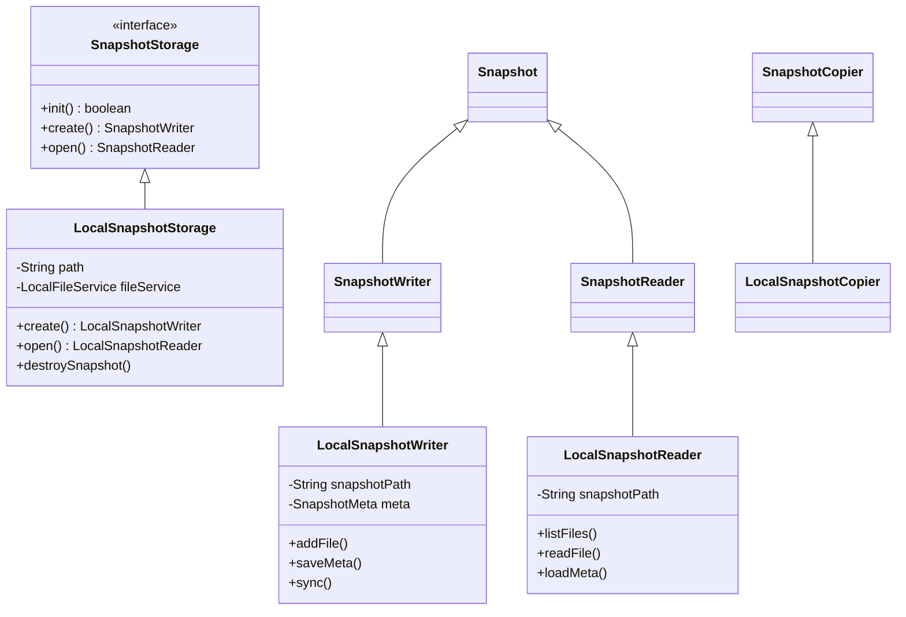
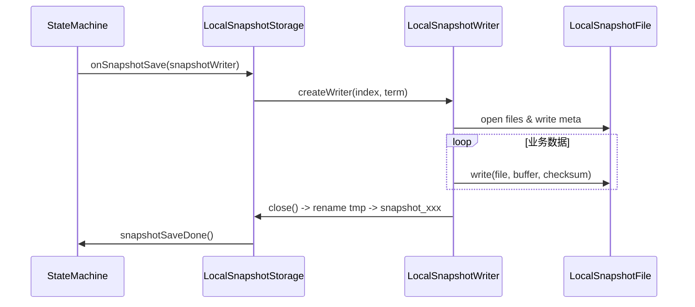
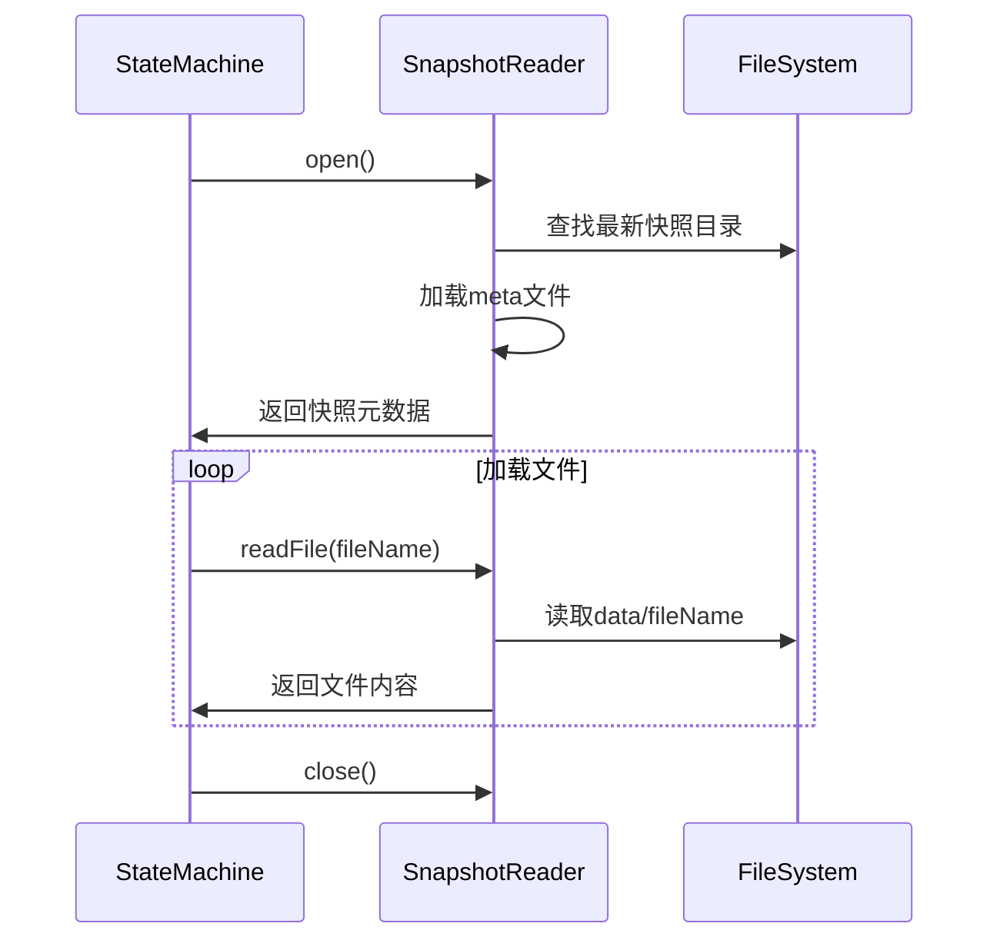
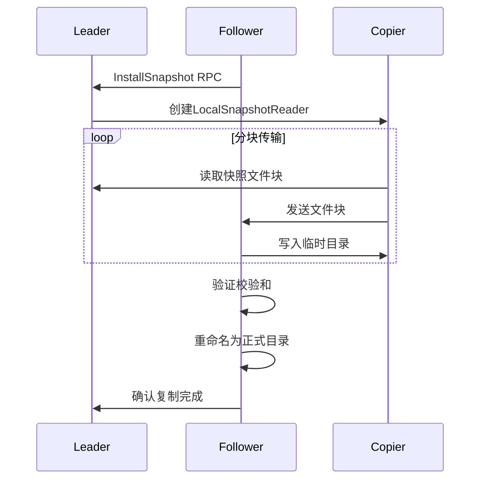

# JRAFT Local Snapshot 实现机制解析

### 概述

在分布式系统中，快照机制是保证系统状态持久化和快速恢复的关键手段。为什么需要快照？

* 日志无限增长问题：Raft 日志会持续累积，导致存储压力增大。
* 新节点快速同步：新节点加入时，通过快照快速追赶最新状态，避免重放全部日志。
* 故障恢复加速：崩溃恢复时，从最新快照加载状态，而非从头重放日志。

> 引用: "The basic idea is to create a snapshot of the latest state of a state machine" 

JRAFT 作为高性能的分布式一致性算法实现框架，其 Local Snapshot 机制能够定期将系统状态保存到本地磁盘，在节点故障恢复时快速加载状态，避免从日志从头开始回放。下面结合 `/com/alipay/sofa/jraft/storage/snapshot/local` 路径下的源码，深入剖析其实现机制。

### 核心类及功能

| 类名 | 功能描述 | 相关源码文件 | 
|--------------------------|-----------------------------|---------------| 
| LocalSnapshotStorage | 负责本地快照的存储管理，包括快照的初始化、创建读写器、删除旧快照等操作。 | /com/alipay/sofa/jraft/storage/snapshot/local/LocalSnapshotStorage.java | 
| LocalSnapshotWriter | 用于将系统状态数据写入快照文件。 | /com/alipay/sofa/jraft/storage/snapshot/local/LocalSnapshotWriter.java | 
| LocalSnapshotReader | 用于从快照文件中读取系统状态数据。 | /com/alipay/sofa/jraft/storage/snapshot/local/LocalSnapshotReader.java | 
| SnapshotMeta | 存储快照的元信息，如快照索引、任期号等。 | /com/alipay/sofa/jraft/storage/snapshot/SnapshotMeta.java |



`Snapshot` 是快照的基础抽象类，定义了快照的基本属性和操作：

```java
public abstract class Snapshot extends Status {
    // 快照元数据文件名
    public static final String JRAFT_SNAPSHOT_META_FILE   = "__raft_snapshot_meta";
    // 快照文件前缀
    public static final String JRAFT_SNAPSHOT_PREFIX      = "snapshot_";
    // 远程快照URI方案
    public static final String REMOTE_SNAPSHOT_URI_SCHEME = "remote://";

    // 获取快照路径
    public abstract String getPath();
    
    // 列出快照中的所有文件
    public abstract Set<String> listFiles();
    
    // 获取指定文件的元数据
    public abstract Message getFileMeta(final String fileName);
}
```

`SnapshotReader` 继承自 `Snapshot`

```java
public abstract class SnapshotReader extends Snapshot implements Closeable, Lifecycle<Void> {
    // 加载快照元数据
    public abstract SnapshotMeta load();
    
    // 生成用于复制此快照的URI
    public abstract String generateURIForCopy();
}
```

`SnapshotWriter` 继承自 `Snapshot`

```java
public abstract class SnapshotWriter extends Snapshot implements Closeable, Lifecycle<Void> {
    // 保存快照元数据
    public abstract boolean saveMeta(final SnapshotMeta meta);
    
    // 添加文件到快照
    public abstract boolean addFile(final String fileName, final Message fileMeta);
    
    // 从快照中移除文件
    public abstract boolean removeFile(final String fileName);
    
    // 关闭写入器
    public abstract void close(final boolean keepDataOnError) throws IOException;
}
```

LocalSnapshot 是本地快照的基本实现，继承自 Snapshot

LocalSnapshotMetaTable 是本地快照元数据表，用于管理快照的元数据信息：

```java
public class LocalSnapshotMetaTable {
    private final Map<String, LocalFileMeta> fileMap;
    private final RaftOptions raftOptions;
    private SnapshotMeta meta;
    
    // 添加文件元数据
    public boolean addFile(final String fileName, final LocalFileMeta meta) {...}
    
    // 移除文件元数据
    public boolean removeFile(final String fileName) {...}
    
    // 保存元数据到文件
    public boolean saveToFile(String path) throws IOException {...}
    
    // 从文件加载元数据
    public boolean loadFromFile(String path) throws IOException {...}
}
```

快照目录结构

```text
snapshot_root/
├── snapshot_1000_1/          # 快照目录（索引_任期）
│   ├── state_machine.data    # 业务状态机数据
│   └── __raft_snapshot_meta  # 元数据文件
└── tmp/                      # 临时操作目录
```

meta文件格式

```protobuf
enum FileSource {
    FILE_SOURCE_LOCAL = 0;
    FILE_SOURCE_REFERENCE = 1;
}

message LocalFileMeta {
    optional bytes user_meta   = 1;
    optional FileSource source = 2;
    optional string checksum   = 3;
}

message SnapshotMeta {
    required int64 last_included_index = 1;
    required int64 last_included_term = 2;
    repeated string peers = 3;
    repeated string old_peers = 4;
    repeated string learners = 5;
    repeated string old_learners = 6;
}

message LocalSnapshotPbMeta {
    message File {
        required string name = 1;
        optional LocalFileMeta meta = 2;
    };
    optional SnapshotMeta meta = 1;
    repeated File files = 2;
}
```

meta文件简单渲染后的关键信息

```json
{
  "meta_version": 1,
  "last_included_index": 100,
  "last_included_term": 5,
  "peers": ["127.0.0.1:8081","127.0.0.1:8082"],
  "files": {
    "state_machine.data": { "checksum": 0xAABBCCDD, "size": 1024 },
    "log_100.log":        { "checksum": 0x11223344, "size": 2048 }
  }
}
```

### 关键数据结构

快照元数据 (SnapshotMeta)

```protobuf
message SnapshotMeta {
    required int64 last_included_index = 1;
    required int64 last_included_term = 2;
    repeated string peers = 3;           // 集群节点列表
    repeated string old_peers = 4;       // 旧集群配置（用于Joint Consensus）
}
```

文件元数据

```protobuf
public class LocalFileMeta {
    private String checksum;  // 文件校验和
    private String source;    // 文件来源（状态机标识）
    private boolean required; // 是否必需文件
}
```

### 写入流程



执行引擎

```java

public class SnapshotExecutorImpl implements SnapshotExecutor {
    public void doSnapshot(final Closure done) {
        ……
        final long distance = this.fsmCaller.getLastAppliedIndex() - this.lastSnapshotIndex;
        if (distance < this.node.getOptions().getSnapshotLogIndexMargin()) {
            ……
            return;
        }
        final SnapshotWriter writer = this.snapshotStorage.create();

        this.savingSnapshot = true;
        final SaveSnapshotDone saveSnapshotDone = new SaveSnapshotDone(writer, done, null);
        this.fsmCaller.onSnapshotSave(saveSnapshotDone)
        ……
    }
}
```

创建Writer

```java
// LocalSnapshotStorage.java
@Override
public SnapshotWriter create() {
    return create(true);
}

public SnapshotWriter create(final boolean fromEmpty) {
    LocalSnapshotWriter writer = null;
    do {
        // 删除临时目录（如果需要）
        if (new File(this.tempPath).exists() && fromEmpty) {
            if (!destroySnapshot(this.tempPath)) {
                break;
            }
        }
        // 创建并初始化写入器
        writer = new LocalSnapshotWriter(this.tempPath, this, this.raftOptions);
        if (!writer.init(null)) {
            LOG.error("Fail to init snapshot writer.");
            writer = null;
            break;
        }
    } while (false);
    return writer;
}
```

写入元信息

```java
// LocalSnapshotWriter.java
public boolean saveMeta(final SnapshotMeta meta) {
    checkState();
    this.metaTable.setMeta(meta);
    return true;
}

public boolean addFile(String fileName, LocalFileMeta fileMeta) {
    String destPath = this.snapshotPath + File.separator + "data" + File.separator + fileName;
    // 1. 创建目标文件
    File destFile = new File(destPath);
    // 2. 状态机将文件写入目标位置
    if (!this.fs.copyFileTo(new File(fileName), destFile)) {
        LOG.error("Copy file failed.");
        return false;
    }
    // 3. 记录文件元数据
    this.files.put(fileName, fileMeta);
    return true;
}
```

关闭writer并提交

```java
// LocalSnapshotStorage.java
void close(final LocalSnapshotWriter writer, final boolean keepDataOnError) throws IOException {
    int ret = writer.getCode();
    IOException ioe = null;

    do {
        if (ret != 0) break;
        
        // 同步元信息到磁盘
        if (!writer.sync()) {
            ret = RaftError.EIO.getNumber();
            break;
        }
        
        // 获取新旧快照索引
        final long oldIndex = getLastSnapshotIndex();
        final long newIndex = writer.getSnapshotIndex();
        if (oldIndex == newIndex) {
            ret = RaftError.EEXISTS.getNumber();
            break;
        }
        
        // 原子重命名临时目录
        final String newPath = getSnapshotPath(newIndex);
        if (!destroySnapshot(newPath)) {
            ret = RaftError.EIO.getNumber();
            break;
        }
        if (!Utils.atomicMoveFile(new File(this.tempPath), new File(newPath), true)) {
            ret = RaftError.EIO.getNumber();
            break;
        }
        
        // 更新引用计数
        ref(newIndex);
        this.lock.lock();
        try {
            this.lastSnapshotIndex = newIndex;
        } finally {
            this.lock.unlock();
        }
        unref(oldIndex);
    } while (false);

    // 处理错误情况
    if (ret != 0 && !keepDataOnError) {
        destroySnapshot(writer.getPath());
    }
}
```

### 读取流程



打开Reader

```java
// LocalSnapshotStorage.java
public SnapshotReader open() {
    long lsIndex = 0;
    this.lock.lock();
    try {
        if (this.lastSnapshotIndex != 0) {
            lsIndex = this.lastSnapshotIndex;
            ref(lsIndex); // 增加引用计数
        }
    } finally {
        this.lock.unlock();
    }
    if (lsIndex == 0) {
        LOG.warn("No data for snapshot reader {}.", this.path);
        return null;
    }
    // 创建并初始化读取器
    final String snapshotPath = getSnapshotPath(lsIndex);
    final SnapshotReader reader = new LocalSnapshotReader(this, this.snapshotThrottle, this.addr, this.raftOptions,
        snapshotPath);
    if (!reader.init(null)) {
        LOG.error("Fail to init reader for path {}.", snapshotPath);
        unref(lsIndex);
        return null;
    }
    return reader;
}
```

初始化并加载元信息

```java
// LocalSnapshotReader.java
@Override
public boolean init(final Void v) {
    final File dir = new File(this.path);
    if (!dir.exists()) {
        LOG.error("No such path {} for snapshot reader.", this.path);
        setError(RaftError.ENOENT, "No such path %s for snapshot reader", this.path);
        return false;
    }
    // 加载元信息文件
    final String metaPath = this.path + File.separator + JRAFT_SNAPSHOT_META_FILE;
    try {
        return this.metaTable.loadFromFile(metaPath);
    } catch (final IOException e) {
        LOG.error("Fail to load snapshot meta {}.", metaPath, e);
        setError(RaftError.EIO, "Fail to load snapshot meta from path %s", metaPath);
        return false;
    }
}
```

文件读取：

```java
// LocalSnapshotReader.java
public void readFile(String fileName, ReadFileClosure done) {
    String filePath = this.path + File.separator + "data" + File.separator + fileName;
    // 异步读取文件内容
    this.fileService.asyncReadFile(filePath, new ReadFileClosureAdapter(done));
}
```

生成远程复制的URI

```java
// LocalSnapshotReader.java
@Override
public String generateURIForCopy() {
    checkState();
    if (this.addr == null || this.addr.equals(new Endpoint(Utils.IP_ANY, 0))) {
        LOG.error("Address is not specified");
        return null;
    }
    if (this.readerId == 0) {
        // 创建文件读取器并注册到文件服务
        final SnapshotFileReader reader = new SnapshotFileReader(this.path, this.snapshotThrottle);
        reader.setMetaTable(this.metaTable);
        if (!reader.open()) {
            LOG.error("Open snapshot {} failed.", this.path);
            return null;
        }
        this.readerId = FileService.getInstance().addReader(reader);
        if (this.readerId < 0) {
            LOG.error("Fail to add reader to file_service.");
            return null;
        }
    }
    // 生成URI
    return String.format(REMOTE_SNAPSHOT_URI_SCHEME + "%s/%d", this.addr, this.readerId);
}
```

### snapshot复制



加载远端元信息

```java
// LocalSnapshotCopier.java
private void loadMetaTable() throws InterruptedException {
    final ByteBufferCollector metaBuf = ByteBufferCollector.allocate(0);
    Session session = null;
    try {
        this.lock.lock();
        try {
            if (this.cancelled) {
                setError(RaftError.ECANCELED, "ECANCELED");
                return;
            }
            // 开始复制元信息文件
            session = this.copier.startCopy2IoBuffer(Snapshot.JRAFT_SNAPSHOT_META_FILE, metaBuf, null);
            this.curSession = session;
        } finally {
            this.lock.unlock();
        }
        session.join(); // 等待复制完成
        this.lock.lock();
        try {
            this.curSession = null;
        } finally {
            this.lock.unlock();
        }
        // 检查状态并加载元信息
        if (!session.status().isOk() && isOk()) {
            setError(session.status().getCode(), session.status().getErrorMsg());
            return;
        }
        if (!this.remoteSnapshot.getMetaTable().loadFromIoBufferAsRemote(metaBuf.getBuffer())) {
            setError(-1, "Bad meta_table format from remote");
            return;
        }
    } finally {
        if (session != null) {
            Utils.closeQuietly(session);
        }
    }
}
```

复制文件

```java
// LocalSnapshotCopier.java
void copyFile(final String fileName) throws IOException, InterruptedException {
    // 检查是否已存在该文件
    if (this.writer.getFileMeta(fileName) != null) {
        LOG.info("Skipped downloading {}", fileName);
        return;
    }
    // 检查文件路径安全性
    if (!checkFile(fileName)) {
        return;
    }
    
    // 创建父目录
    final String filePath = this.writer.getPath() + File.separator + fileName;
    final Path subPath = Paths.get(filePath);
    if (!subPath.equals(subPath.getParent())) {
        final File parentDir = subPath.getParent().toFile();
        if (!parentDir.exists() && !parentDir.mkdirs()) {
            LOG.error("Fail to create directory for {}", filePath);
            setError(RaftError.EIO, "Fail to create directory");
            return;
        }
    }

    // 获取文件元信息并开始复制
    final LocalFileMeta meta = (LocalFileMeta) this.remoteSnapshot.getFileMeta(fileName);
    Session session = null;
    try {
        this.lock.lock();
        try {
            if (this.cancelled) {
                setError(RaftError.ECANCELED, "ECANCELED");
                return;
            }
            session = this.copier.startCopyToFile(fileName, filePath, null);
            this.curSession = session;
        } finally {
            this.lock.unlock();
        }
        session.join(); // 等待复制完成
        this.lock.lock();
        try {
            this.curSession = null;
        } finally {
            this.lock.unlock();
        }
        // 检查复制结果并更新元信息
        if (!session.status().isOk() && isOk()) {
            setError(session.status().getCode(), session.status().getErrorMsg());
            return;
        }
        if (!this.writer.addFile(fileName, meta)) {
            setError(RaftError.EIO, "Fail to add file to writer");
            return;
        }
        if (!this.writer.sync()) {
            setError(RaftError.EIO, "Fail to sync writer");
        }
    } finally {
        if (session != null) {
            Utils.closeQuietly(session);
        }
    }
}
```

断点续传：

```java
// LocalSnapshotCopier.java
public void cancel() {
    this.cancelled = true;
    // 保存当前传输进度
    saveCopierStatus(); 
}

private void saveCopierStatus() {
    // 记录已传输的文件和偏移量
    Status status = new Status();
    status.setProgress(this.transferredSize);
    status.setFiles(this.copiedFiles);
    // 将状态写入临时文件
}
```

### 一致性保证

1. 原子提交：使用临时目录（tmp_xxx）准备快照；完成后原子重命名为正式目录
2. 校验和

```java
// LocalSnapshotStorage.java
public boolean verify(String path, SnapshotMeta meta) {
    for (String file : listFiles(path)) {
        String checksum = calcFileChecksum(file);
        if (!meta.getFileMeta(file).getChecksum().equals(checksum)) {
            return false; // 校验失败
        }
    }
    return true;
}
```

3. 版本隔离：每个快照以 `snapshot_{index}_{term}` 格式命名，只读方式打开快照，避免运行时修改

### 性能优化

1. 增量快照

```java
public boolean addFile(String fileName, LocalFileMeta meta) {
    if (meta.hasChecksum() && checkFileExists(meta)) {
        // 跳过未修改文件
        return true; 
    }
    // ... 复制修改过的文件
}
```

2. 并行传出

```java
// SnapshotExecutor.java
void doSnapshot(Closure done) {
    executorService.submit(() -> {
        // 后台线程执行快照
        stateMachine.onSnapshotSave(writer);
    });
}
```

3. 资源限制

```java
// SnapshotExecutorOptions
public class SnapshotExecutorOptions {
    private int maxSnapshotBytesPerRpc = 8 * 1024 * 1024; // 8MB
    private int maxSnapshotConcurrency = 5;
}
```