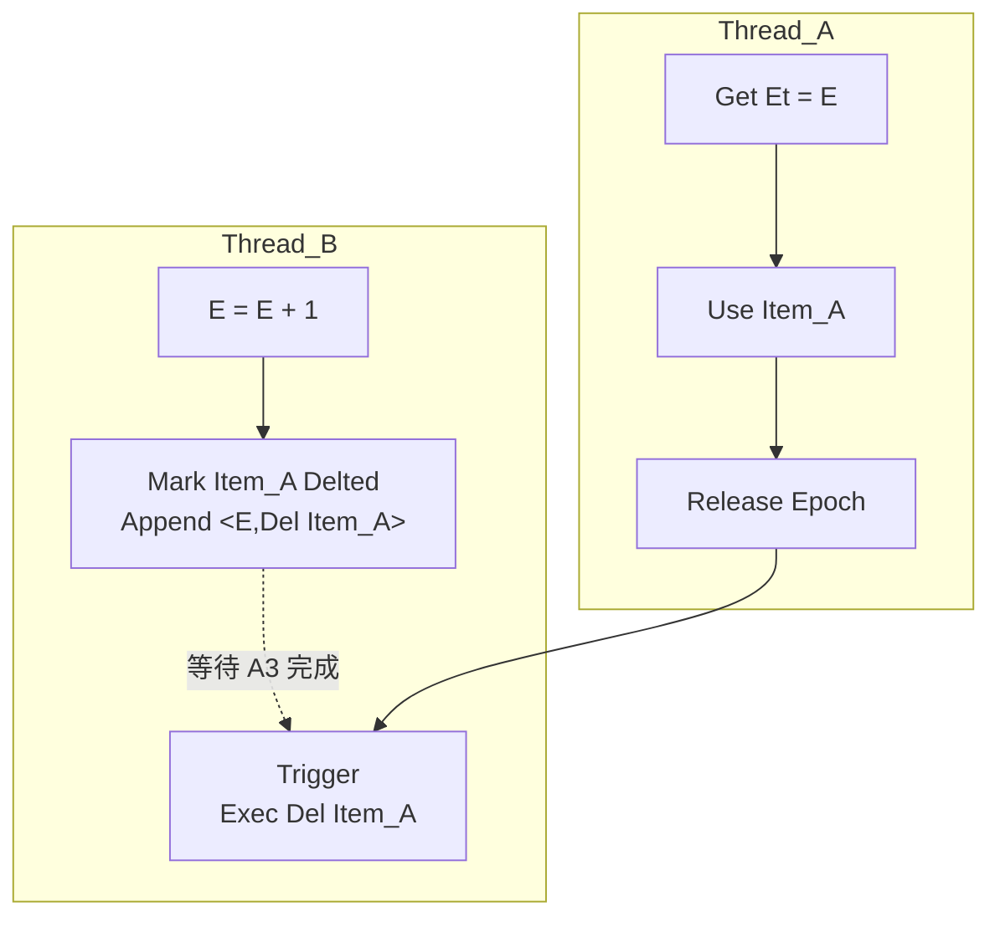

# [FastKV](https://microsoft.github.io/FASTER/)

#DB_engine

> https://github.com/microsoft/FASTER
> https://microsoft.github.io/FASTER/docs/quick-start-guide/
> https://www.microsoft.com/en-us/research/uploads/prod/2018/03/faster-sigmod18.pdf

FasterKV的整体架构可分为3个部分：

1. 多个并发的工作线程
   1. 基于Epoch Protection的思想，结合原子操作完成无锁的线程间同步
2. Hash索引，每个HashEntry指向一批Records，基于链地址法解决Hash冲突
   1. Record即数据的实际存储格式，包含Key & Value
   2. Index中不包含Key & Value，仅存储由Allocator分配的逻辑地址，将Index和Allocator彻底解耦
3. Record Allocators，Record的实际分配器，包含三种不同的实现方式：
   1. In-Memory，即全内存存储
   2. Append-Only-Log，基于Append-Only的大数据量解决方案
   3. Hybrid-Log，融合上面两种思想，支持就地更新(in-place updates)的大数据量解决方案

## Epoch protection下的线程模型



当 Thread_A 准备进入并发区域时，会先获取当前最新的 Epoch 值。接着，它会把这个最新的 Epoch 值更新到线程本地的 Et 中，并将 Et 存入 EpochTable。完成这些准备工作后，Thread_A 开始进入并发区域对 Item_A 进行使用操作。在使用完毕后，Thread_A 会将自身线程本地的 Et 还原为进入并发区域前的值，以此确保线程本地状态的一致性。

当 Thread_B 想要对 Item_A 执行删除操作时，它会检查是否存在处于前一个 Epoch 且仍处于活动状态的线程。如果发现有这样的线程，Thread_B 不会立即进行物理删除，而是选择一种软删除策略。具体来说，Thread_B 会通过原子比较并交换（CAS）操作将 Item_A 标记为软删除。之后，Thread_B 会把物理删除操作封装成一个回调函数（Callback）。这个回调函数会被暂时搁置，等待 Epoch 达到安全状态（即不存在前一个 Epoch 的活动线程）。一旦 Epoch 变为安全状态，Thread_B 就会触发这个回调函数，完成对 Item_A 的延迟删除操作。

## 索引

* 全内存无锁并发：采用全内存 Hash 索引，支持无锁并发访问，提升并发性能。
* 轻量化存储：索引不存储实际 Key&Value，仅保存 Record 地址，节省内存，同时便于与存储分配器解耦。
* 逻辑地址管理：通过自定义逻辑地址概念管理数据，Index 不关注数据实际存储位置，增强灵活性。
* cache-line 优化：针对 cache-line 进行设计，提高内存访问效率。

**结构布局**：索引由连续内存构成，划分为 $2^k$ 个 Hash 槽，每个槽含多个 64 字节 Hash Bucket，通过尾指针串联。每个 Bucket 再细分为 8 份，前 7 份存 Record Address（Hash Entry），最后 1 份作尾指针。

- 由 8 个 8 - byte 单元组成
    - 前 7 个 8 - byte 单元：
        - 1 bit ：Tentative Bit ，用于解决插入等 CAS 操作冲突，实现两阶段提交
        - 15 bits ：Tag ，区分不同 Key 的标志之一
        - 48 bits ：Address ，实际指向 record 的地址
    - 第 8 个 8 - byte 单元：
        - Next Bucket Address ，作为尾指针串联同一个 Hash 槽的下一个 Hash Bucket 

Record 大小为 8 bytes ，具体构成如下：

- 16 bits ：Meta ，存储 Record 的元数据
- 48 bits ：Address ，指向相关数据的地址

Record 实际存储内容包括 Header、Key、Value ，其中 Header 中包含指针，用于串联下一条 Record 。 

## IO流程

1. **查找Entry**
   - 通过 `hash & (size - 1)` 定位到对应的 `HashBucket`。
   - 遍历 `HashBucket` 并比较 `tag` 以找到对应的 `HashEntry`。
   - 若要查找实际的 `Key`，需遍历 `HashEntry` 指向的链表来寻找相同 `Key` 的 `Record`。
2. **删除Entry**
   - 先查找到对应的 `Entry`。
   - 利用原子CAS操作将其置为0。
3. **插入Entry**
   - 插入操作借助查找 `Key` 和原子CAS实现，如对 `Entry` 或 `Record Next Address` 进行CAS操作。
   - **并发插入问题**：多线程无锁并发时可能出现冲突，例如线程 `T1` 想在空 `Entry` 插入新 `tag`（如 `g5`），同时线程 `T2` 删除`g3` 处的 `Entry` 并置为 `Empty Entry`，若 `T2` 随后算出相同的 `(offset, tag)`（如 `g5`）并插入，可能导致出现两个 `g5`违背设计原则。
   - **解决方案**：采用“两阶段”策略，利用 `tentative bit` 解决并发插入问题，具体步骤如下：
        - 线程扫描整个 `Bucket`，找到一个 `Empty Entry` 并设置索引，将 `tentative bit` 置为1，此时该 `Entry` 对读写都不可见。
        - 线程重新扫描整个 `Bucket`，检查是否有相同的 `tag` 且 `tentative bit` 为1，若有则回滚重试（通过CAS还原之前修改的 `Entry`）。
        - 若未发现冲突，将 `tentative bit` 置为0。

## Rehash

FasterKV 采用链地址法解决哈希冲突

1. **优点**：支持多线程同时并发Rehash，能在一定程度上提高Rehash的效率，充分利用多线程的优势加速数据迁移。
2. **缺点**：
    - 整个Rehash过程是阻塞的，这会对请求处理造成抖动，在大数据量场景下，可能会严重影响系统的响应性能。
    - 仅支持扩容，不支持缩容，功能相对单一，不能根据实际数据量的变化灵活调整哈希表的大小。

其执行过程如下：

1. **索引维护**：和Redis类似，维护两个哈希索引（Old Index和New Index），但没有Redis的渐进式特性。
2. **状态机**：使用状态机来管理Rehash过程，包括Prepare、Resizing以及Stable三个状态。
3. **发起与准备**：某个线程发起Rehash任务时，获取Epoch，分配New Index内存（扩容为原来的2倍），切换状态至Prepare，并通知其他线程切换状态。
4. **并发处理**：所有线程都准备好后，切换到Resizing状态，多线程并发地将原Hash Index切分成多个chunk，各自独立完成数据迁移。
5. **完成与状态切换**：所有线程完成迁移后，交换Old Index和New Index，切换状态为Stable，Rehash过程结束。

## 内存分配

FasterKV的Record Allocator有三种存储分配器，代表着向大数据量、高吞吐演进的不同阶段：

1. **In-Memory**：纯内存实现，支持in-place updates，能高效访问内存中的热数据，写操作无锁，通过Epoch Protection和原子CAS实现线程间无锁并发。
2. **Append-Only Log**：用逻辑地址连接内存和二级存储（磁盘等），对上层屏蔽实现细节。内存数据用Circular Buffer管理，有Head Offset（记录内存数据最低位逻辑地址）和Tail Offset（逻辑地址尾部）。
    - **数据更新、删除和读取**：
        - **Blind Update**：Append新Record到Log Tail，通过CAS更新Index。
        - **Delete**：Append带tombstone（标记删除）的Record到Log Tail，CAS更新Index，旧Record等待GC回收。
        - **Read**：找到HashEntry后遍历Record List，根据Record Header存储的Address判断数据是否在内存，不在则发起异步IO任务。
    - **内存数据沉降**：为实现无锁的内存到磁盘沉降，维护Flush status（确定Page是否已刷盘）和Closed status（确定Page是否可逐出）两个status array。Tail Offset增大时推进Head Offset，用Epoch Protection的Trigger Action触发异步IO刷盘，所有线程写完成后设置Flush Status，确保Page已刷盘且无线程访问后逐出Page。
    - **不支持In-place updates原因**：刷盘是异步操作，支持In-place updates可能需要加锁处理数据更新，因此不支持。Append-only架构在写入密集型负载下可能导致IO瓶颈。

```plaintext
     ─────────── Increasing Logical Address ------->
     ┌───────────────────────────────────────────────────┐
     │                                                   │
     │ ┌──────────────┐   ┌───────────────────────────┐  │
     │ │ On-Disk      │   │ In-Memory Circular Buffer │  │
     │ │ LA = 0 - k-1 │   │                           │  │
     │ └──────────────┘   └───────────────────────────┘  │
     │                   Head Offset         Tail Offset │
     │                   (LA = k)            (LA = k+Δ)  │
     └───────────────────────────────────────────────────┘
```

3. **Hybrid Log**：Append-Only Log的优化版。
    - **逻辑地址组成**：分为Mutable（内存中，写请求通过in-place update）、Read-Only（内存中，写请求基于写时拷贝，修改数据需Copy到Mutable Tail）、Stable（磁盘中，需异步IO读上来在Mutable Tail变更）三个部分。
    - **多线程时序问题及解决**：推进Read-Only Offset时多线程并发可能导致更新时序问题。引入Safe Read-Only Offset记录全局安全Offset，Epoch管理，只有Safe Read-Only Offset前的数据是绝对Read-Only，Safe Read-Only Offset到Read-Only Offset间是Fuzzy Region，更新由复杂状态机管理。
    - **性能特点**：内存部分类似缓存，Mutable和Read-Only按9:1划分时性能较好，较大的Read-Only Region可能导致append-only update代价高，log增长快。


## 数据备份与恢复

FasterKV通过Checkpoint快照机制实现数据备份与恢复，涉及Index和Log Record两部分数据持久化。

- **持久化Index原因**：避免大数据量场景下，仅靠回放Log Record重建存储引擎（需重新执行插入和删除操作构建Index）带来的低效问题，加速Recovery。

### Checkpoint流程

- 后台线程扫描Index时，前台线程持续写入，Log持续更新。记录扫描开始时Tail Offset为t1，结束时为t2 。
- t1 - t2间的Log Record包含除in-place update外的所有更新（因in-place update不改变index ）。
- 将Index拆分为多个Chunk，并发刷入多个磁盘文件（Overflow的HashBuckets单独存于一个文件 ）。推进Read-Only Offset到t2，并刷盘t2前所有数据，完成Checkpoint。

### Recovery流程

- 读回Index文件到内存，重建Index（其原本为连续内存 ）。
- 读回Overflow的HashBuckets到内存重建。
- 依据持久化的Read-Only Offset清理无效Index（数据已丢失部分 ），完成恢复。

### 存在问题

- **快照精度问题**：仅支持模糊时间点快照，无法提供精确时间点快照。
- **因果性问题**：in-place update导致Scan Index时可就地更新t1 - t2间数据并落盘Checkpoint，但t2后数据宕机后丢失，可能出现“先写数据丢失，后写数据存在”情况 。或可通过Epoch解决（论文未讨论实现，可考虑如打Checkpoint后延迟t1 offset后in-place update写入，读时从Trigger list读取 ）。
- **无WAL问题**：写入流程为性能未采用WAL，Recovery完全依赖Checkpoint频率，宕机时内存数据全部丢失，在生产环境中较难接受。

### CPR解决方案（Concurrent Prefix Recovery）

- 各线程维护逻辑上单调递增时间序列，操作伴随Sequence Number。
- 写操作暂不立即返回，堆积后刷盘（可配置 ）。
- 线程发起Checkpoint任务时，各线程依自身Sequence Number确定Commit Point。
- 通过Commit Point在Hybrid Log上定位Offset并刷盘。通过合并多次请求统一刷盘，结合定期Checkpoint Index，可完整恢复数据，性能优于WAL方案。 