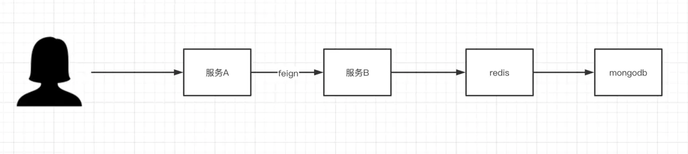

# How jaeger works

### 那么jaeger是怎么在方法调用的时候埋点记录的？

1. 拦截器？动态代理？每一次调用记录节点？怎么确定span之间的关系？
2. 这些节点信息在同一个服务是怎么传递的？比如Threadlocal。如果是多线程应该怎么传递？
3. 在不同服务之间是怎么传递？隐式传参？放在header里面？dubbo，http，springcloud？

#### 举一个完整的调用链过程



那么jaeger是在哪些节点埋点的？经分析，jaeger分别在如下地方埋点。


#### 那么这些中间节点的实现逻辑又是怎样的？


> 下面是详细的代码分析，代码量太多，也可直接跳到各章总结。

#### 一、span的记录

**1. Servlet请求：**

从ServerTracingAutoConfiguration类开始（为什么从这里开始？详情见[springboot如何自动加载](https://www.jianshu.com/p/e1e996265983)  
 ）  
 该类初始化了FilterRegistrationBean

> 这个类为springboot的拦截器注册bean，看代码逻辑即加载了TracingFilter拦截器。

```java
@Bean
    @ConditionalOnMissingBean(TracingFilter.class)
    public FilterRegistrationBean tracingFilter(Tracer tracer, WebTracingProperties tracingConfiguration) {
        log.info(format("Creating %s bean with %s mapped to %s, skip pattern is \"%s\"",
                FilterRegistrationBean.class.getSimpleName(), TracingFilter.class.getSimpleName(),
                tracingConfiguration.getUrlPatterns().toString(),
                tracingConfiguration.getSkipPattern()));

        List<ServletFilterSpanDecorator> decorators = servletFilterSpanDecorator.getIfAvailable();
        //初始化装饰器（添加一下tag属性）
        if (CollectionUtils.isEmpty(decorators)) {
            decorators = Collections.singletonList(ServletFilterSpanDecorator.STANDARD_TAGS);
        }
        //初始化TracingFilter拦截器
        TracingFilter tracingFilter = new TracingFilter(tracer, decorators, tracingConfiguration.getSkipPattern());

        FilterRegistrationBean filterRegistrationBean = new FilterRegistrationBean(tracingFilter);
        filterRegistrationBean.setUrlPatterns(tracingConfiguration.getUrlPatterns());
        filterRegistrationBean.setOrder(tracingConfiguration.getOrder());
        filterRegistrationBean.setAsyncSupported(true);
        return filterRegistrationBean;
    }
```

下面再来看看TracingFilter类，看看他是如何拦截请求的？  
 io.opentracing.contrib.web.servlet.filter.TracingFilter：

```java
@Override
    public void doFilter(ServletRequest servletRequest, ServletResponse servletResponse, FilterChain chain)
            throws IOException, ServletException {
        HttpServletRequest httpRequest = (HttpServletRequest) servletRequest;
        HttpServletResponse httpResponse = (HttpServletResponse) servletResponse;
       //判断该url是否需要跟踪，如果不需要跟踪则跳过。配置项为skipPattern
        if (!isTraced(httpRequest, httpResponse)) {
            chain.doFilter(httpRequest, httpResponse);
            return;
        }

        /**
         * If request is traced then do not start new span.
         */
       //判断请求的head里是否有span上下文，如果有则跳过，因为上一步已经记录了，避免重复记录
        if (servletRequest.getAttribute(SERVER_SPAN_CONTEXT) != null) {
            chain.doFilter(servletRequest, servletResponse);
        } else {
            //重点部分1：创建context
            SpanContext extractedContext = tracer.extract(Format.Builtin.HTTP_HEADERS,
                    new HttpServletRequestExtractAdapter(httpRequest));
           //重点部分2：创建span
            final Scope scope = tracer.buildSpan(httpRequest.getMethod())
                    .asChildOf(extractedContext)
                    .withTag(Tags.SPAN_KIND.getKey(), Tags.SPAN_KIND_SERVER)
                    .startActive(false);

            httpRequest.setAttribute(SERVER_SPAN_CONTEXT, scope.span().context());

            for (ServletFilterSpanDecorator spanDecorator: spanDecorators) {
                spanDecorator.onRequest(httpRequest, scope.span());
            }

            try {
                chain.doFilter(servletRequest, servletResponse);
…………下面代码忽略……
```

下面再来对上文所提到的重点部分进行分析

**context的创建**

```text
SpanContext extractedContext = tracer.extract(Format.Builtin.HTTP_HEADERS,
                    new HttpServletRequestExtractAdapter(httpRequest));
```

> 其中 tracer.extract方法中，会对http header的key进行抽取。详情请看io.jaegertracing.internal.propagation.TextMapCodec

> 1. uber-trace-id\(span上下文context\)
> 2. uberctx- （baggage items的前缀）
> 3. jaeger-debug-id （debug跟踪id）

> 题外：  
>  如果你要对某一个请求进行调试。可以在请求头中加入
>
> ```text
> curl -H "jaeger-debug-id: custom_debug_id12343434" http://localhost:2434
> ```
>
> 此时span的tag中会有jaeger-debug-id，可以在ui中通过这个jaeger-debug-id标签进行跟踪  
>  baggage:你希望带上的自定义属性值叫做baggage。在属于同一个context的span中传递。（应避免使用，baggage不能过大）

**span的创建**

scope（个人理解：该scope是对span和上一个span的包装）

```text
final Scope scope = tracer.buildSpan(httpRequest.getMethod())
                    .asChildOf(extractedContext) //赋值references
                    .withTag(Tags.SPAN_KIND.getKey(), Tags.SPAN_KIND_SERVER)//赋值tags
                    .startActive(false);

```

io.jaegertracing.internal.JaegerTracer.SpanBuilder\#startActive：

```text
@Override
    public Scope startActive(boolean finishSpanOnClose) {
      return scopeManager.activate(start(), finishSpanOnClose);
    }

```

> 根据代码跟踪，jaeger用到了ThreadLocalScopeManager类，来管理scope，该类通过ThreadLocal的特性，记录不同线程的最新scope

io.opentracing.util.ThreadLocalScopeManager\#activate\(io.opentracing.Span, boolean\)

```text
 @Override
    public Scope activate(Span span, boolean finishOnClose) {
        return new ThreadLocalScope(this, span, finishOnClose);
    }
```

> ThreadLocalScope属性介绍:  
>  toRestore：该线程上一个scope  
>  wrapped: 该线程的最新span

> ThreadLocalScope的close方法\(恢复上一个scope状态）：如果finishOnClose的true，则调用该方法时，会将触发最新span的close方法。最后将当前线程的scope设置为该scope保存的上一个scope。

详情请看io.opentracing.util.ThreadLocalScope\#close

下面再来看看最新span的创建过程  
 io.jaegertracing.internal.JaegerTracer.SpanBuilder\#start

```text
@Override
    public JaegerSpan start() {
      JaegerSpanContext context;
……上部分代码忽略……
     if (references.isEmpty() || !references.get(0).getSpanContext().hasTrace()) {
      //如果没有reference则创建context（创建traceId，spanId与traceId相同，parentId=0）
        context = createNewContext();
      } else {
        //有reference，创建子context(设置traceId为上一个context的traceId，父parentId为上一个context的spanId，生成自己的spanId)
        context = createChildContext();
      }

      …………

    //创建span
      JaegerSpan jaegerSpan = getObjectFactory().createSpan(
              JaegerTracer.this,
              operationName,
              context,
              startTimeMicroseconds,
              startTimeNanoTicks,
              computeDurationViaNanoTicks,
              tags,
              references);
      if (context.isSampled()) {
        metrics.spansStartedSampled.inc(1);
      } else {
        metrics.spansStartedNotSampled.inc(1);
      }
      return jaegerSpan;
    }
```

下面再来看看span的结束过程  
 即TracingFilter的doFilter方法的最后过程，先对span触发finish方法，再对scope进行关闭操作

```text
 scope.span().finish();

```

```text
 scope.close();
```

#### 总结1

1. 对于Servlet请求，都会走filter过滤器。jaeger会对请求分发前生成span，该请求后续所做的子操作（如数据库查询、redis查询、跨服务调用）都是该span的子span
2. 应用threadlocal特性，不同线程通过ThreadlocalManager管理。ThreadLocalManager存储的是每个线程的最新scope
3. scope的概念：存储当前的span和上一个scope的内容。
4. scope的作用：可以方便设置父子关系，并恢复到上一个父节点，继续记录与其他子节点的关系

**2. 如果要对其他组件进行监控，使用静态代理模式对原有bean进行封装。如redis、jdbc、mongo**

从redis简单分析：  
 io.opentracing.contrib.redis.spring.data.connection.TracingRedisConnection：

> 该类实现了RedisConnection接口，成员变量为系统中原来的redisConnection

```text
    public Object execute(String command, byte[]... args) {
        return this.helper.doInScope(command, () -> {
            return this.connection.execute(command, args);
        });
    }

```

在执行comand前，先创建scope  
 io.opentracing.contrib.redis.common.TracingHelper\#doInScope\(java.lang.String, java.util.function.Supplier&lt;T&gt;\):

```text
public <T> T doInScope(String command, Supplier<T> supplier) {
    Span span = buildSpan(command);
    return activateAndCloseSpan(span, supplier);
  }

```

创建span  
 io.opentracing.contrib.redis.common.TracingHelper\#buildSpan\(java.lang.String\):

```text
public Span buildSpan(String operationName) {
    if (traceWithActiveSpanOnly && tracer.activeSpan() == null) {
      return NoopSpan.INSTANCE;
    } else {
      return builder(operationName).start();
    }
  }
```

将创建的span设置到最新的scope中，执行完后关闭span和scope  
 io.opentracing.contrib.redis.common.TracingHelper\#activateAndCloseSpan\(io.opentracing.Span, java.util.function.Supplier&lt;T&gt;\)

```text
private <T> T activateAndCloseSpan(Span span, Supplier<T> supplier) {
    //try(scope)，程序执行完会自动调用scope.close()方法
    try (Scope ignored = tracer.activateSpan(span)) {
      return supplier.get();
    } catch (Exception e) {
      TracingHelper.onError(e, span);
      throw e;
    } finally {
      span.finish();
    }
  }

```

#### 总结2

1. redis、jdbc、mongo等组件通过静态代理模式对原有组件进行封装实现监控目的
2. 执行前-&gt;创建span-&gt;设置scope-&gt;执行-&gt;span触发finish方法-&gt;scope触发close方法

**3. 不同服务之间的传递（feign）**

feign.opentracing.TracingClient\#execute  
 -&gt;feign.opentracing.TracingClient\#inject //将span注入header \(traceId:spanId: parentId:flag）  
 -&gt;delegate.execute\(request, options\)

#### 总结3

对于下一个服务来说，这个是一个servlet请求，所以会走上文提到的servlet过滤器逻辑。

### 二、span的上报

span上报流程  


问题1：怎么确定需要上报？  
 JaegerAutoConfiguration初始化bean：Sampler，该样本采样器决定span是否需要上报。  
 ConstSampler：常量采样器（true or false），默认所有都采集  
 ProbabilisticSampler：概率采样器（samplingRate:0.001,比如0.1%的span会被收集）  
 RateLimitingSampler：令牌桶采样器（maxTracesPerSecond，一秒多少个Trace）  
 RemoteControlledSampler：远程控制采样器

问题2：如何上报？  
 JaegerAutoConfiguration初始化bean：Reporter

```text
@ConditionalOnMissingBean
  @Bean
  public Reporter reporter(JaegerConfigurationProperties properties,
      Metrics metrics,
      @Autowired(required = false) ReporterAppender reporterAppender) {

    List<Reporter> reporters = new LinkedList<>();
    RemoteReporter remoteReporter = properties.getRemoteReporter();

    JaegerConfigurationProperties.HttpSender httpSender = properties.getHttpSender();
    if (!StringUtils.isEmpty(httpSender.getUrl())) {
      reporters.add(getHttpReporter(metrics, remoteReporter, httpSender));
    } else {
      reporters.add(getUdpReporter(metrics, remoteReporter, properties.getUdpSender()));
    }

    if (properties.isLogSpans()) {
      reporters.add(new LoggingReporter());
    }

    if (reporterAppender != null) {
      reporterAppender.append(reporters);
    }

    return new CompositeReporter(reporters.toArray(new Reporter[reporters.size()]));
  }
```

由代码可知，实际为CompositeReporter类，即组合所有reporter，报告时将所有reporter遍历执行一遍。  
 在开发中，可以实现自己的自定义reporter，只需实现ReporterAppender即可。

```text
@Component
public class CustomReporter implements ReporterAppender {

    @Override
    public void append(Collection<Reporter> reporters) {
            reporters.add(new CustomLogReporter());
    }
}
```

```text
public class CustomLogReporter implements io.jaegertracing.spi.Reporter {

    private Logger logger = LoggerFactory.getLogger(CustomLogReporter.class);
    @Override
    public void report(JaegerSpan span) {
        io.jaegertracing.thriftjava.Span thriftSpan = JaegerThriftSpanConverter.convertSpan(span);
        logger.info("Span reported: {}", JSON.toJSONString(thriftSpan));
    }

    @Override
    public void close() {

    }
}
```

再来看看默认的udp报告器  
 io.opentracing.contrib.java.spring.jaeger.starter.JaegerAutoConfiguration\#createReporter：

```text
private Reporter createReporter(Metrics metrics,
      RemoteReporter remoteReporter, Sender udpSender) {
    io.jaegertracing.internal.reporters.RemoteReporter.Builder builder =
        new io.jaegertracing.internal.reporters.RemoteReporter.Builder()
            .withSender(udpSender)
            .withMetrics(metrics);

    if (remoteReporter.getFlushInterval() != null) {
      builder.withFlushInterval(remoteReporter.getFlushInterval());
    }
    if (remoteReporter.getMaxQueueSize() != null) {
      builder.withMaxQueueSize(remoteReporter.getMaxQueueSize());
    }

    return builder.build();
  }
```

```text
public RemoteReporter build() {
      if (sender == null) {
        sender = SenderResolver.resolve();
      }
      if (metrics == null) {
        metrics = new Metrics(new InMemoryMetricsFactory());
      }
      return new RemoteReporter(sender, flushInterval, maxQueueSize, closeEnqueTimeout, metrics);
    }
```

可知，http和udp的报告器实际都是RemoteReporter类

```text
private RemoteReporter(Sender sender, int flushInterval, int maxQueueSize, int closeEnqueueTimeout,
      Metrics metrics) {
    this.sender = sender;
    this.metrics = metrics;
    this.closeEnqueueTimeout = closeEnqueueTimeout;
    //命令队列（最大size默认100）
    commandQueue = new ArrayBlockingQueue<Command>(maxQueueSize);

    //开启一个队列处理线程去把comand取出来
    queueProcessor = new QueueProcessor();
    queueProcessorThread = new Thread(queueProcessor, "jaeger.RemoteReporter-QueueProcessor");
    queueProcessorThread.setDaemon(true);
    queueProcessorThread.start();
    //FlushTimer定时任务
    flushTimer = new Timer("jaeger.RemoteReporter-FlushTimer", true /* isDaemon */);
    flushTimer.schedule(
        new TimerTask() {
          @Override
          public void run() {
            flush();
          }
        },
        flushInterval,
        flushInterval);
  }
```

队列处理任务：将command从队列取出并执行

```text
@ToString
  class QueueProcessor implements Runnable {
    private boolean open = true;

    @Override
    public void run() {
      while (open) {
        try {
          RemoteReporter.Command command = commandQueue.take();
          try {
            command.execute();
          } catch (SenderException e) {
            metrics.reporterFailure.inc(e.getDroppedSpanCount());
          }
        } catch (Exception e) {
          log.error("QueueProcessor error:", e);
          // Do nothing, and try again on next span.
        }
      }
    }
```

FlushTimer定时任务具体逻辑（默认每秒执行一次）：往command队列中添加FlushCommand

```text
void flush() {
    // to reduce the number of updateGauge stats, we only emit queue length on flush
    metrics.reporterQueueLength.update(commandQueue.size());

    // We can safely drop FlushCommand when the queue is full - sender should take care of flushing
    // in such case
    commandQueue.offer(new FlushCommand());
  }
```

再来看看span的finish方法：

```text
@Override
  public void finish(long finishMicros) {
    finishWithDuration(finishMicros - startTimeMicroseconds);
  }

  private void finishWithDuration(long durationMicros) {
    synchronized (this) {
      if (finished) {
        log.warn("Span has already been finished; will not be reported again.");
        return;
      }
      finished = true;

      this.durationMicroseconds = durationMicros;
    }

    if (context.isSampled()) {
      tracer.reportSpan(this);
    }
  }
```

io.jaegertracing.internal.reporters.RemoteReporter\#report：

```text
@Override
  public void report(JaegerSpan span) {
    // Its better to drop spans, than to block here
    boolean added = commandQueue.offer(new AppendCommand(span));

    if (!added) {
      metrics.reporterDropped.inc(1);
    }
  }
```

> 可知当触发span的finish方法时，实际是向报告器上报span，但是并不是马上发送远程服务器，只是在reporter的command队列中添加AppendCommand

最后再来看看FlushCommand和AppendCommand

```text
  class FlushCommand implements Command {
    @Override
    public void execute() throws SenderException {
      int n = sender.flush();
      metrics.reporterSuccess.inc(n);
    }
  }

```

```text
class AppendCommand implements Command {
    private final JaegerSpan span;

    public AppendCommand(JaegerSpan span) {
      this.span = span;
    }

    @Override
    public void execute() throws SenderException {
      int n = sender.append(span);
      if (n > 0) {
        metrics.reporterSuccess.inc(n);
      }
    }
  }
```

可知分别用到了sender的append方法和flush方法。  
 UdpSender：  
image.png

> 有兴趣的可细看这两个方法
>
> 1. append方法：实质是sender.append会追加到该bean的成员变量：spanBuffer。下一步判断spanBuffer是否超过maxBytes（默认65000），如果超过则会触发sender的flush方法。
> 2. flush方法：将spanBuffer发送到远程服务器

#### 总结4

1. 只有一个线程真正执行向远程服务器上报的逻辑
2. span完成后不是马上上报，而是积累到一定的大小或到达一定的时间才会触发上报功能。
3. 当队列最大长度设置过短，线程处理不过来时，span容易丢失。设置过大，又有可能导致内存溢出。
4. 默认每秒会向队列中插入一个发送命令，但该命令不一定一秒后执行，因为有一个线程会处理这个命令队列，一秒后不一定能处理到该发送命令。

自己画的代码分析流程图  
 [https://www.processon.com/view/link/5eb911ab5653bb6f2a00da9b](https://links.jianshu.com/go?to=https%3A%2F%2Fwww.processon.com%2Fview%2Flink%2F5eb911ab5653bb6f2a00da9b)  
 [https://www.processon.com/view/link/5eb913930791290fe0571c8c](https://links.jianshu.com/go?to=https%3A%2F%2Fwww.processon.com%2Fview%2Flink%2F5eb913930791290fe0571c8c)  
 [https://www.processon.com/view/link/5e9d116c5653bb6efc5bb761](https://links.jianshu.com/go?to=https%3A%2F%2Fwww.processon.com%2Fview%2Flink%2F5e9d116c5653bb6efc5bb761)  
  
作者：Olla\_0632  
链接：https://www.jianshu.com/p/d0b6b75302b9  
来源：简书  
著作权归作者所有。商业转载请联系作者获得授权，非商业转载请注明出处。

